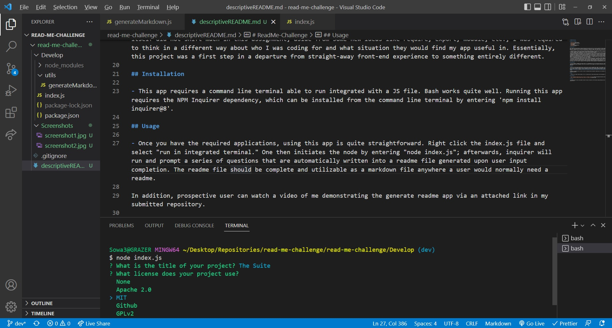
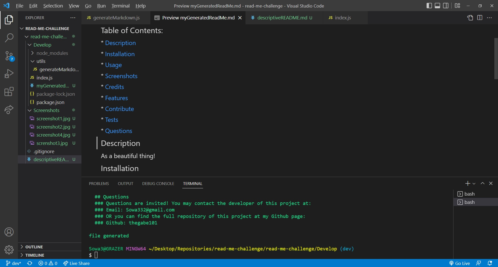

# ReadMe-Challenge

## Table of Contents

- [Description](#description)
- [Installation](#installation)
- [Usage](#Usage)
- [Bugs](#Bugs)
- [Screenshots](#screenshots)
- [Credits](#credits)

## Description

This project involved creating a terminal-level app that would allow for user input to questions fired by Inquirer.js, a Node.js NPM. Upon answering the questions prompted after initiating the app in the command line, the app automatically generates a markdown file for the user that autocompletes traditional readme content data based upon the user's input.

- The motivation for creating this app was primarily gaining recognition of the runtime environments (out-of-browser) Node.js enables. In addition, the creative process involved tinkering with Node.js methods such as 'fs' and 'require,' as well as writing template literal strings filled by user input from an exported function.
- This was a unique project challenging in its own ways. This was my first experiencing running JavaScript code in a runtime environment away from the browser, and it was eye-opening to see all we can do that is not just related to website interactivity (including interacting with the OS and computer at a hardware level). This app was also challenging in that it demanded proper scoping of variables that were being passed from one function to another. Previously, working with one JavaScript file, scoping was fairly straightforward. Here, I had to think about how my two files were interacting, which required a more measured approach for how I was scoping variables. This project also required careful consideration of semantics from the user PoV; being asked to fill out information in a command terminal is not intuitive to most computer users, so phrasing questions carefully and clearly was important.
- This is a potentially useful project largely in what it demonstrates we can do if inclined: creating applications that run outside of the traditional web browser that might allow for file generation, read/write abiltiies, and much more.
- This project was quite challenging in that it was so different from anything else we'd done so far. While the code itself did not shift much in this assignment, aside from some new ideas like require, export, module, etc., I was required to think in a different way about who I was coding for and what situation they would find my app useful in. Essentially, this project was a first step in a departure from straight-away front-end experience to something entirely different.

## Installation

- This app requires a command line terminal able to run integrated with a JS file. Bash works quite well. Running this app requires the NPM Inquirer dependency, which can be installed from the command line terminal by entering 'npm install inquirer@8'.

## Usage

- Once you have the required applications, using this app is quite straightforward. Right click the index.js file and select "run in integrated terminal." One then initiates the node by entering "node index.js"; afterwards, inquirer will run and prompt a series of questions that are automatically written into a readme file generated upon user input completion. The readme file should be complete and utilizable as a markdown file anywhere a user would normally need a readme.

In addition, prospective user can watch a video of me demonstrating the generate readme app via an attached link in my submitted repository.

## Bugs

- Licenses do not always render properly. This is a known bug and is being inquired about with the developers educators.

## Screenshots

- 
- 
- 
- 
- 

## Credits

- This page could not have come together without the help of educators at UW FullStack Coding Bootcamp and my tutor, Jacob Carver.
